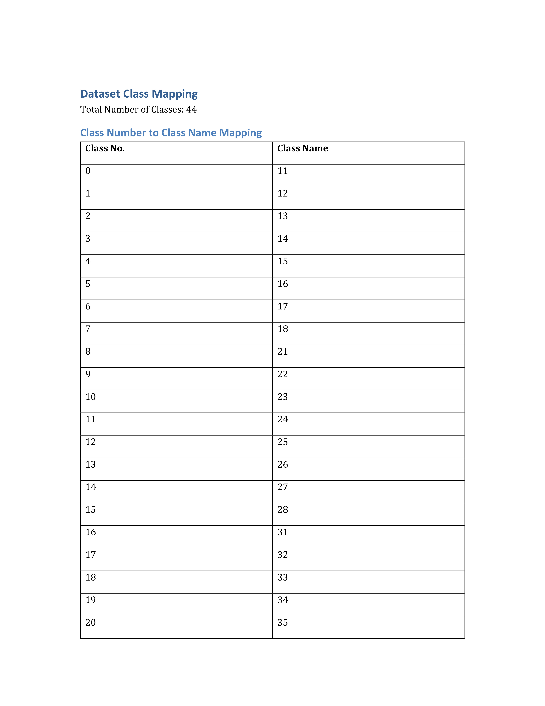
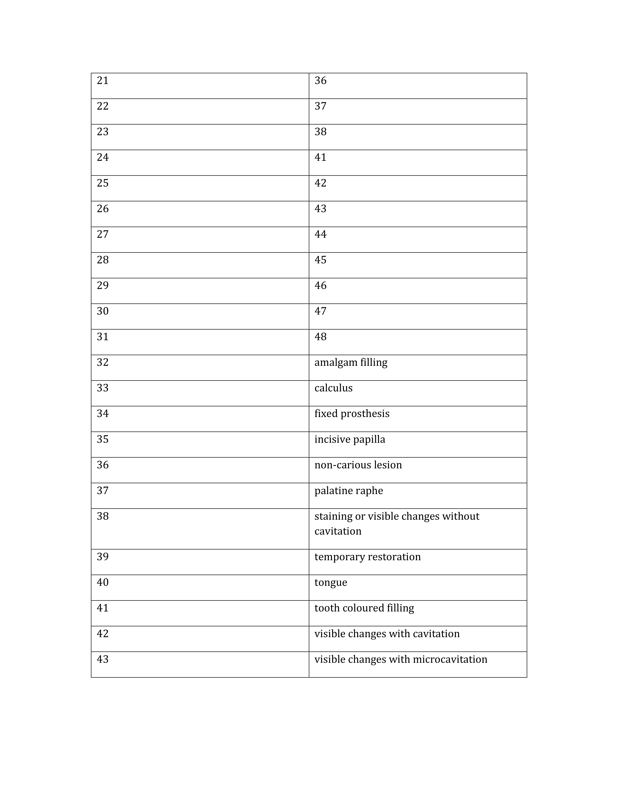

# Dental Disease Detection using YOLOv8

## CSE499 - Senior Design Capstone Project

A deep learning-based system for automated detection and localization of dental diseases in oral photographs using YOLOv8 object detection framework with Gemini AI-powered image analysis.

## Overview

This project implements a state-of-the-art dental disease detection system using PyTorch and YOLOv8. The system is capable of identifying and localizing various dental conditions from custom dental photographs, providing an automated solution to assist dental professionals in diagnosis and treatment planning. Enhanced with Gemini 2.5 Flash for intelligent image analysis and labeling.

## Features

- **Multi-disease Detection**: Detects various dental diseases including caries, gingivitis, calculus, and other oral conditions
- **Real-time Inference**: Fast detection using optimized YOLOv8 architecture
- **Gemini AI Integration**: Gemini 2.5 Flash image analysis to label specific regions or detect and label the whole image
- **Custom Dataset**: Trained on a curated dataset of dental photographs
- **YOLOv8 Segmentation Format**: Utilizes industry-standard YOLOv8 segmentation format with class coordinates
- **Interactive Web Interface**: Streamlit-based application for easy deployment and usage
- **Pre-trained Checkpoint**: Includes best performing model checkpoint for immediate deployment

## Technical Architecture

- **Framework**: PyTorch
- **Model**: YOLOv8 (You Only Look Once v8)
- **AI Assistant**: Gemini 2.5 Flash API
- **Input**: Custom dental photographs (RGB images)
- **Annotation Format**: YOLOv8 segmentation format with class coordinates
- **Task**: Object Detection, Segmentation, and Localization

## Installation

### Prerequisites

- Python 3.8+
- CUDA-capable GPU (recommended for training)
- Gemini API Key (for AI-powered analysis)

### Setup

1. Clone the repository:
```bash
git clone https://github.com/adityadattamallick/cse499-dental-disease-detection.git
cd cse499-dental-disease-detection
```

2. Create a virtual environment (recommended):
```bash
python -m venv venv
source venv/bin/activate  # On Windows: venv\Scripts\activate
```

3. Install dependencies:
```bash
pip install -r requirements.txt
```

4. Configure Gemini API:

Create a `.env` file in the project root directory and add your Gemini API key:
```
GEMINI_API_KEY="your_gemini_api_key_here"
```
Replace `your_gemini_api_key_here` with your actual Gemini API key.

## Usage

### Running the Application

Navigate to the project's `src` folder and run the Streamlit application:
```bash
cd src
streamlit run app.py
```

The application will open in your default web browser, providing an interactive interface for dental disease detection and analysis.

## Dataset

- **Format**: YOLOv8 segmentation format with class coordinates
- **Image Type**: Custom dental photographs
- **Classes**: Multiple dental disease categories

The dataset follows YOLOv8 segmentation annotation standards where each image has a corresponding `.txt` file with normalized polygon coordinates:
```
class_id x1 y1 x2 y2 x3 y3 ... xn yn
```

## Dataset Details

The dataset comprises multiple classes of dental conditions and diseases. Below are the detailed class mappings used in this project:

<div align="center">
  
  <br/>
  <em>Dataset Class Mapping - Part 1</em>
  <br/><br/>
  
  
  <br/>
  <em>Dataset Class Mapping - Part 2</em>
</div>

These tables provide comprehensive information about the disease classes, their identifiers, and categorization used for training and evaluation.

## Model Performance

- **Metrics**
  - Box mAP@0.5
  - Box mAP@0.5:0.95
  - Mask mAP@0.5
  - Mask mAP@0.5:0.95

## Methodology

1. **Data Collection**: Curated custom dataset of dental photographs
2. **Annotation**: YOLOv8 segmentation format with class coordinates
3. **Preprocessing**: Image augmentation
4. **Training**: YOLOv8 model trained with PyTorch backend
5. **Validation**: Cross-validation and testing on holdout set
6. **Deployment**: Optimized checkpoint for inference with Streamlit interface

## Requirements

See `requirements.txt` for complete list of dependencies. Key libraries include:

- PyTorch
- Ultralytics (YOLOv8)
- OpenCV
- NumPy
- Matplotlib
- Pillow
- Streamlit
- Google Generative AI (Gemini)

## Contributing

This is a Senior Design Capstone project. For collaboration or questions, please open an issue or contact the project maintainer.

## Contact

**Project Author**: Aditya Narayan Datta Mallick  
**Institution**: North South University, Dhaka, Bangladesh<br /> 
**Course**: CSE499 - Senior Design & Capstone Project

## License

This project is licensed under the MIT License - see the [LICENSE](LICENSE) file for details.

MIT License

Copyright (c) 2025 Aditya Narayan Datta Mallick

Permission is hereby granted, free of charge, to any person obtaining a copy
of this software and associated documentation files (the "Software"), to deal
in the Software without restriction, including without limitation the rights
to use, copy, modify, merge, publish, distribute, sublicense, and/or sell
copies of the Software, and to permit persons to whom the Software is
furnished to do so, subject to the following conditions:

The above copyright notice and this permission notice shall be included in
all copies or substantial portions of the Software.

THE SOFTWARE IS PROVIDED "AS IS", WITHOUT WARRANTY OF ANY KIND, EXPRESS OR
IMPLIED, INCLUDING BUT NOT LIMITED TO THE WARRANTIES OF MERCHANTABILITY,
FITNESS FOR A PARTICULAR PURPOSE AND NONINFRINGEMENT. IN NO EVENT SHALL THE
AUTHORS OR COPYRIGHT HOLDERS BE LIABLE FOR ANY CLAIM, DAMAGES OR OTHER
LIABILITY, WHETHER IN AN ACTION OF CONTRACT, TORT OR OTHERWISE, ARISING FROM,
OUT OF OR IN CONNECTION WITH THE SOFTWARE OR THE USE OR OTHER DEALINGS IN
THE SOFTWARE.

## Acknowledgments

- Saif Ahmed
- Dr Nabeel Mohammed

## References

- [YOLOv8 Documentation](https://docs.ultralytics.com/)
- [PyTorch Documentation](https://pytorch.org/docs/)
- [Streamlit Documentation](https://docs.streamlit.io/)
- [Streamlit Cropper Tool](https://github.com/turner-anderson/streamlit-cropper)
- [Google Gemini API](https://ai.google.dev/)

---